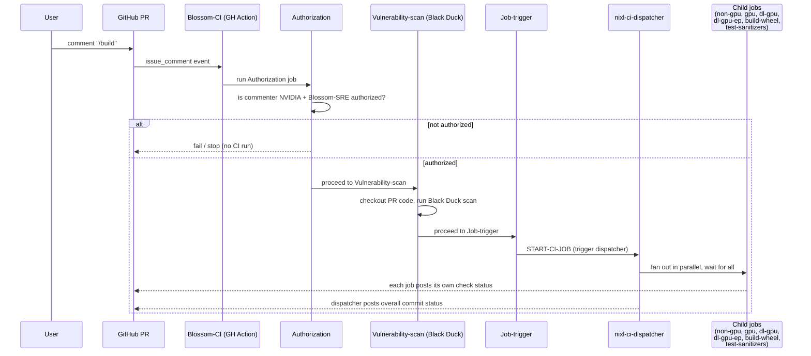

# NIXL CI Overview

This document catalogs every CI job in the NIXL repository — GitHub Actions
workflows (`.github/workflows/`) and Jenkins jobs triggered through
Blossom-CI (`.ci/jenkins/`) — and states whether each one runs
**automatically on every PR**, or is a **standalone/manual** job that only
runs on-demand (`workflow_dispatch`, a PR comment, or a cron schedule).

## Quick reference

| Job | System | Trigger | Automatic on every PR? |
|---|---|---|---|
| [NVIDIA NIXL Validation](#nvidia-nixl-validation-build_validationyml) (`mirror_repo`, `trigger-ci`) | GitHub Actions | `push` to `main` / `pull-request/<n>` | Yes |
| [AWS NIXL Validation](#aws-nixl-validation-aws_efa_validationyml) | GitHub Actions | `push` to `main` / `pull-request/<n>` | Yes |
| [Clang Format Check](#clang-format-check-clang-formatyml) | GitHub Actions | `pull_request` | Yes |
| [Copyright Checks](#copyright-checks-copyright-checksyml) | GitHub Actions | `pull_request` | Yes |
| [PR Size Check](#pr-size-check-pr-size-checkyml) | GitHub Actions | `pull_request` | Yes |
| [Python Checks](#python-checks-python-checksyml) | GitHub Actions | `pull_request` | Yes |
| [Run Pre-Commit Hooks](#run-pre-commit-hooks-pre-commityml) | GitHub Actions | `push`, `pull_request` | Yes |
| [Claude Code Review](#claude-code-review-claude-reviewyml) | GitHub Actions | `pull_request` (opened/synchronize/reopened) | Yes |
| [External Contributor](#external-contributor-external_contributoryaml) | GitHub Actions | `pull_request_target` (opened, fork only) | Yes (fork PRs only) |
| [Blossom-CI](#blossom-ci-blossom-ciyml) | GitHub Actions | `/build` PR comment, or `workflow_dispatch` | No — manual |
| `nixl-ci-dispatcher` → `non-gpu`, `gpu`, `dl-gpu`, `dl-gpu-ep`, `build-wheel`, `test-sanitizers` | Jenkins (dispatcher-triggered) | Fan-out from Blossom-CI `Job-trigger` | No — only after `/build`, but these 6 are the *only* Jenkins jobs in the PR CI path |
| `nixl-ci-build-container` | Jenkins (standalone) | Nightly cron + manual | No — never runs as part of PR CI |
| `nixl-ci-build-wheel-nightly` | Jenkins (standalone) | Nightly cron + manual | No — never runs as part of PR CI |
| `nixl-ci-build-llm-container` | Jenkins (standalone) | Manual only | No — never runs as part of PR CI |
| `nixl-ci-test-llm-container` | Jenkins (standalone) | Manual, or chained from `build-llm-container` via `RUN_TEST` | No — never runs as part of PR CI |

> **Note on Jenkins jobs:** `proj-jjb.yaml` defines 10 Jenkins jobs, but only the
> 6 that `nixl-ci-dispatcher` fans out to are ever part of the PR CI flow. The
> other 4 (`build-container`, `build-wheel-nightly`, `build-llm-container`,
> `test-llm-container`) are entirely standalone — they run only on a nightly
> cron or when someone triggers them manually from the Jenkins UI, and are
> never invoked by the dispatcher or by a PR event.

## GitHub Actions workflows

All files below live in `.github/workflows/`.

### NVIDIA NIXL Validation (`build_validation.yml`)
- **Trigger:** `push` to `main` or to a `pull-request/<n>` ref (GitHub auto-creates this ref for open PRs).
- **What it does:** `mirror_repo` syncs the repo to an internal GitLab mirror; `trigger-ci` then POSTs to a GitLab pipeline (`PIPELINE_URL`) using the same ref, kicking off the internal GitLab CI pipeline.
- **Automatic on every PR:** Yes — this is the trigger that starts the internal GitLab-side pipeline for every push/PR update.

### AWS NIXL Validation (`aws_efa_validation.yml`)
- **Trigger:** same as above — `push` to `main` / `pull-request/<n>`.
- **What it does:** Runs the AWS EFA validation test suite (`run_aws_tests`) against AWS infrastructure.
- **Automatic on every PR:** Yes.

### Clang Format Check (`clang-format.yml`)
- **Trigger:** `pull_request`.
- **What it does:** Runs `clang-format-19` over the C/C++ lines changed in the PR (excluding `examples/device/ep`) and fails on formatting violations.
- **Automatic on every PR:** Yes.

### Copyright Checks (`copyright-checks.yml`)
- **Trigger:** `pull_request`.
- **What it does:** Runs `.github/workflows/copyright-check.sh` inside the `dynamo/helm-tester` container to verify SPDX/copyright headers.
- **Automatic on every PR:** Yes.

### PR Size Check (`pr-size-check.yml`)
- **Trigger:** `pull_request`.
- **What it does:** Fails the PR if it changes more than 500 lines (excluding `subprojects/*`).
- **Automatic on every PR:** Yes.

### Python Checks (`python-checks.yml`)
- **Trigger:** `pull_request`.
- **What it does:** Runs `.ci/scripts/check_prints.sh` against `./src`, `./test`, `./benchmark`, `./examples/python` to flag stray `print()` calls.
- **Automatic on every PR:** Yes.

### Run Pre-Commit Hooks (`pre-commit.yml`)
- **Trigger:** `push`, `pull_request`.
- **What it does:** Runs the repo's configured `pre-commit` hooks against files modified in the PR/push.
- **Automatic on every PR:** Yes.

### Claude Code Review (`claude-review.yml`)
- **Trigger:** `pull_request` (`opened`, `synchronize`, `reopened`).
- **What it does:** Generates the PR diff and runs an automated Claude-based code review, posting results as PR feedback.
- **Automatic on every PR:** Yes.

### External Contributor (`external_contributor.yaml`)
- **Trigger:** `pull_request_target`, `opened`.
- **What it does:** Posts a reminder comment, only `if` the PR's head repo differs from the base repo (i.e., a fork PR).
- **Automatic on every PR:** Only fires for PRs from forks — a no-op job condition otherwise.

### Blossom-CI (`blossom-ci.yml`)
- **Trigger:** `issue_comment` (only proceeds `if` the comment body is exactly `/build`), or manual `workflow_dispatch`.
- **What it does:** `Authorization` validates the commenter is authorized; `Vulnerability-scan` checks out the PR code and runs the Blossom vulnerability scan action; `Job-trigger` calls `blossom-ci` with `OPERATION: START-CI-JOB`, which kicks off the Jenkins `nixl-ci-dispatcher` job (see below); `Upload-Log` (on `workflow_dispatch` only) links the Jenkins build log back to the PR.
- **Automatic on every PR:** **No.** This is a maintainer-gated, manual step — someone with commit access must comment `/build` on the PR to start the full Jenkins pipeline.

#### Blossom-CI flow

Step by step, matching the jobs in `blossom-ci.yml`:

1. A user comments `/build` on the PR.
2. The `Blossom-CI` GitHub Action wakes up on the `issue_comment` event.
3. **Authorization** checks the commenter is allowed to trigger CI: non-NVIDIA
   users cannot trigger it at all, and NVIDIA employees need prior
   authorization from the Blossom SRE team. Unauthorized comments stop here.
4. **Vulnerability-scan** checks out the PR's code and runs a Black
   Duck-based vulnerability scan via the `NVIDIA/blossom-action`.
5. **Job-trigger** calls `blossom-ci` with `OPERATION: START-CI-JOB`, which
   triggers the Jenkins `nixl-ci-dispatcher` job.
6. `nixl-ci-dispatcher` fans out in parallel to its six child jobs
   (`non-gpu`, `gpu`, `dl-gpu`, `dl-gpu-ep`, `build-wheel`,
   `test-sanitizers` — see [Jenkins jobs](#jenkins-jobs) below).
7. Each child job reports its own status back as an individual GitHub PR
   check, so the PR shows per-job pass/fail rather than one aggregate check.

## Jenkins jobs

All 10 Jenkins jobs are defined in `.ci/jenkins/pipeline/proj-jjb.yaml`
(Jenkins Job Builder config) and run through the shared pipeline entry point
`.ci/jenkins/pipeline/Jenkinsfile`. None of them run directly off GitHub
events — they only start via the Jenkins webhook fired by Blossom-CI, or via
their own nightly/manual trigger. They split into two groups:

- **Dispatcher-triggered (part of the PR CI path):** `nixl-ci-dispatcher` and
  the 6 jobs it fans out to. This is the *only* way any Jenkins job runs
  against a PR, and only after a `/build` comment.
- **Standalone (never run against a PR):** `nixl-ci-build-container`,
  `nixl-ci-build-wheel-nightly`, `nixl-ci-build-llm-container`,
  `nixl-ci-test-llm-container` — each has its own nightly cron and/or manual
  trigger and is invoked independently of PRs and of the dispatcher.

### `nixl-ci-dispatcher` (dispatcher-triggered)
- **Trigger:** GitHub webhook payload forwarded by Blossom-CI's `Job-trigger` step (`OPERATION: START-CI-JOB`). Not a raw GitHub Actions event.
- **What it does:** Fans out in parallel to six downstream Jenkins jobs, waiting on all of them:
  - `nixl-ci-non-gpu` — `.ci/jenkins/lib/build-matrix.yaml`
  - `nixl-ci-gpu` — `.ci/jenkins/lib/test-matrix.yaml`
  - `nixl-ci-dl-gpu` — `.ci/jenkins/lib/test-dl-matrix.yaml` (dlcluster.nvidia.com)
  - `nixl-ci-dl-gpu-ep` — `.ci/jenkins/lib/test-dl-ep-matrix.yaml` (nixl_ep elastic tests on dlcluster.nvidia.com)
  - `nixl-ci-build-wheel` — `.ci/jenkins/lib/build-wheel-matrix.yaml`
  - `nixl-ci-test-sanitizers` — `.ci/jenkins/lib/test-sanitizer-matrix.yaml` (ASan/UBSan + TSan)
- **Automatic on every PR:** No — only runs after a `/build` comment triggers Blossom-CI. Each sub-job also aborts any stale in-flight run for the same PR before starting.

### `nixl-ci-build-container` (standalone)
- **Trigger:** Nightly cron (builds `nixlbench` and `nixl` targets, on both the default CUDA base image and the DLFW PyTorch daily image, ~3–4 AM), or manual run with parameters (`BUILD_TARGET`, `NIXL_VERSION`, `UCX_VERSION`, base image overrides, etc.).
- **What it does:** Builds and pushes x86_64/aarch64 NIXL/NIXLBench container images to Artifactory.
- **Automatic on every PR:** No — standalone/nightly + manual only.

### `nixl-ci-build-wheel-nightly` (standalone)
- **Trigger:** Nightly cron (two runs, CUDA 13 and CUDA 12 base images, from `main`), or manual run from any branch/tag/PR ref/SHA.
- **What it does:** Reuses the per-PR wheel build path (`contrib/build-container.sh` + `Dockerfile.manylinux`), adds UCX wiring, and publishes verification wheels to Artifactory.
- **Automatic on every PR:** No — standalone/nightly + manual only.

### `nixl-ci-build-llm-container` (standalone)
- **Trigger:** Manual only (no cron, no webhook).
- **What it does:** Builds the 4 LLM inference container variants (`vllm-nixl`, `vllm-cu12-nixl`, `sglang-nixl`, `sglang-cu13-nixl`) for x86_64/aarch64 from a published NIXL wheel set, publishes multi-arch manifests, and optionally (`RUN_TEST`) fires `nixl-ci-test-llm-container` per built variant.
- **Automatic on every PR:** No — standalone/manual only, used for release verification.

### `nixl-ci-test-llm-container` (standalone)
- **Trigger:** Manual, or chained asynchronously from `nixl-ci-build-llm-container` when `RUN_TEST` is enabled.
- **What it does:** Runs smoke/perf/accuracy tests for one published LLM inference container image on the `mizu` SLURM partition (2-GPU node); framework (vllm/sglang) is auto-detected from the image URL.
- **Automatic on every PR:** No — standalone/manual only.

## How to trigger CI manually

- **Full Jenkins pipeline for a PR:** comment `/build` on the PR (requires authorization — see `Authorization` step in `blossom-ci.yml`).
- **Re-run a single Jenkins job with different parameters:** use `workflow_dispatch` on `blossom-ci.yml`, or trigger the Jenkins job directly if you have Jenkins access.
- **Container/wheel builds outside the nightly schedule:** run `nixl-ci-build-container` or `nixl-ci-build-wheel-nightly` manually from the Jenkins UI with custom parameters.

## Related docs

- [Build Wheel Matrix CI Job Documentation](build-wheel-matrix-ci.md) — deep dive into `nixl-ci-build-wheel`.
- [Setting up NVIDIA GPU with RDMA support on Ubuntu](setup_nvidia_gpu_with_rdma_support_on_ubuntu.md)
